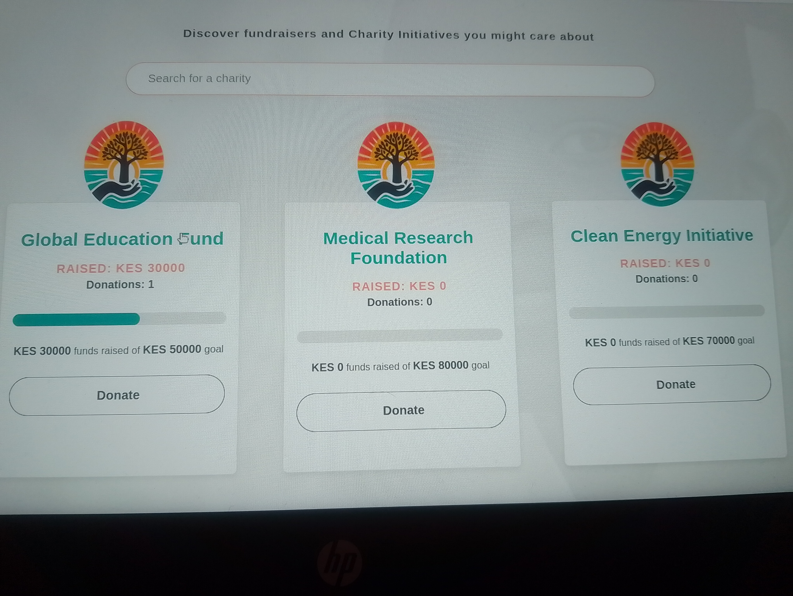
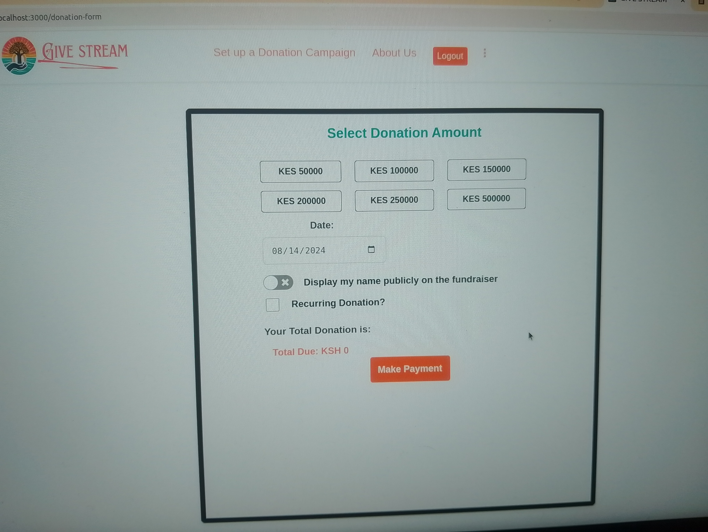
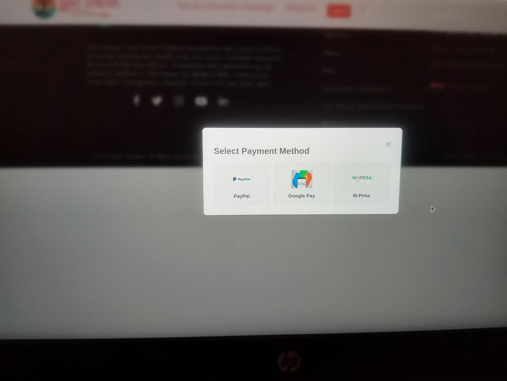
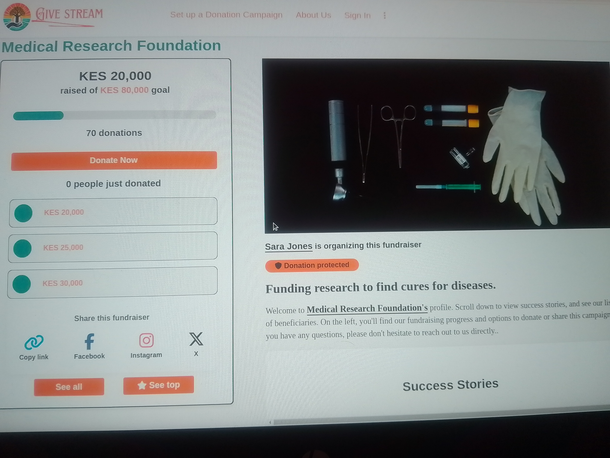
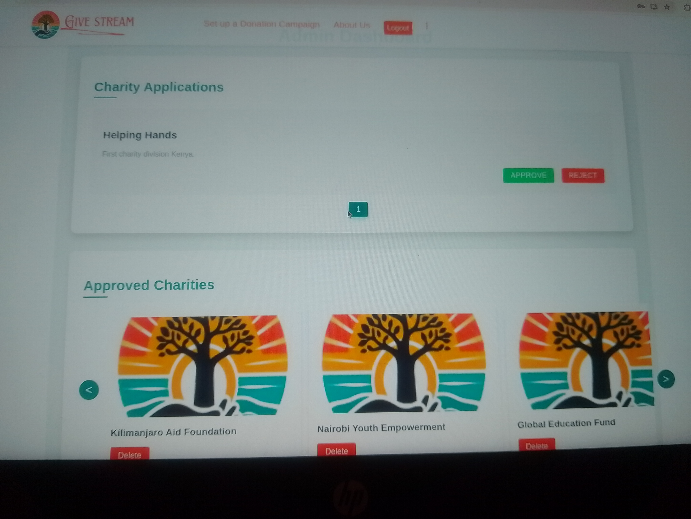
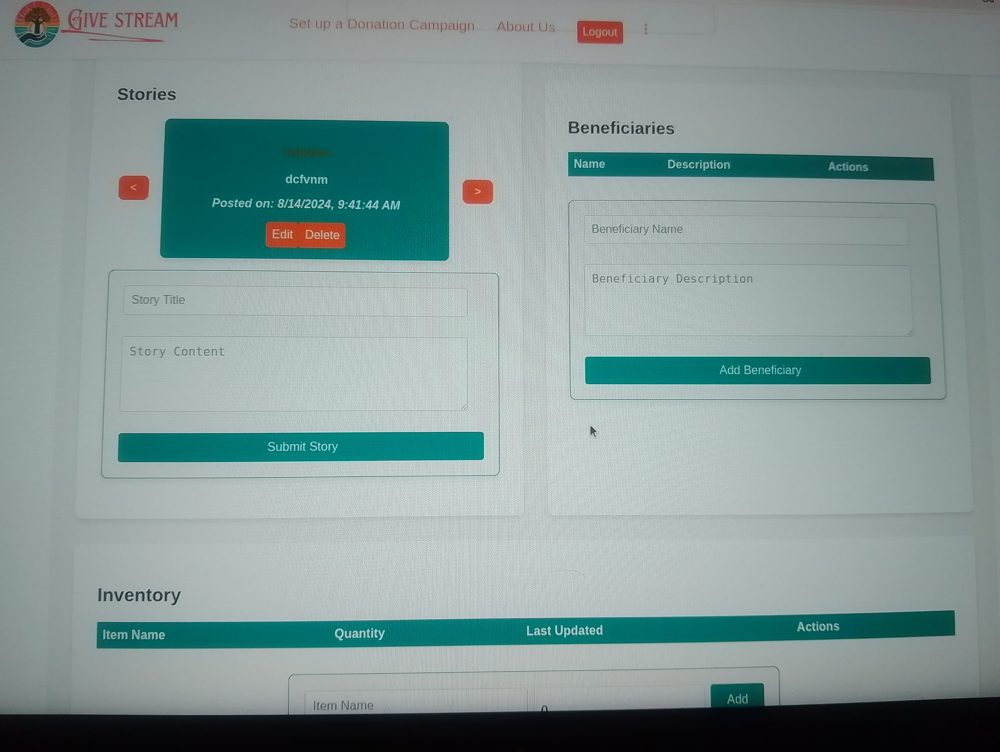

# CARECONNECT APP

  

## Table of Contents
- [Introduction](#introduction)
- [Problem Statement](#problem-statement)
- [Key Features](#key-features)
- [Launching](#launching)
  - [Endpoints](#endpoints)
- [Prerequisites](#prerequisites)
- [Installations](#installations)
  - [Backend](#backend)
  - [Frontend](#frontend)
- [Running givestream Locally](#To-run-givestream-locally-follow-these-teps)
- [Usage](#usage)
- [Development Notes](#development-notes)
- [Security Considerations](#security-considerations)
- [MVPs](#mvps)
  - [MVP 1:  Donor activitiesManagement](#mvp-1-Donor-activities)
  - [MVP 2: Charity Aplications Management](#mvp-2-charity-application-management)
  - [MVP 3: Stories, beneficiaries and inventory Management](#mvp-3-Stories-beneficiaries-inventory-Management)
  - [MVP 4: Admin, Donor and Charity Login](#mvp-4-Admin-Donor-Charity-Login)
- [Technologies Used](#technologies-used)
- [License](#license)
- [Contributors](#contributors)

## INTRODUCTION

Givestream is an automated donation platform that connects charities to high-end esteemed donors who are willing to help and change the world. We encourage charities to apply to be on the platform as it facilitates proper, reliable and efficient donations. To the donors, tha displayed charities have undergone vetting and been approved by admin so there are no cons on the app.

## Problem Statement

In most sub-saharan countries, school going girls are unable to access pads and other supplies needed for their periods. The year 2016 studies from ministry of education revealed girls from poor families miss 20 % of school days in a year due to lack of sanitary towels the data indicated that a girl in primary school between class 6 and 8 can lose up to 18 weeks out of 108 weeks while those in high school can lose almost 24 weeks out of 144 weeks of learning. An organisation dedicated to dealing with this problem is working on not just providing sanitary towels but also providing clean water and sanitation facilities such as toilets to ensure they are able to meet the guidelines for proper menstrual hygiene as defined by UNICEF.

## Key Features

- ## 1. Donors
    - Charity Listing: A simple interface where donors can browse through available charities. This feature is essential for donors to find organizations they wish to support.
    - Account Creation: Basic account creation functionality allowing donors to sign up using username and password. This is necessary for personalizing the donation experience.
    - Donation Process:
        - Selecting a Charity: Ability to choose a charity from the list.
        - Making a Donation: Option to donate via PayPal, Gpay or Mpesa, covering the most common payment methods initially.
        - One-Time vs. Automated Donations:Setting up automated monthly, weekly or yearly donations.
        - Anonymity Option: A checkbox during the donation process that allows donors to choose whether their donation should be anonymous.
        - Monthly Reminders: Automated emails sent to donors who opt for monthly donations, reminding them of their upcoming donation date.
        - Beneficiary Stories: A section where charities can post stories about beneficiaries, allowing donors to see the impact of their donations(can view charity dashboard).

- ## 2.  Charities
    - Charity Application Process: A form for charities to apply to join the platform, including basic details about the organization.
    - Charity Dashboard:
    - Donor Information: View list of non-anonymous donors along with their donation details.
    - Anonymous Donations: Total amount donated by anonymous donors.
    - Total Donations Received: Overall donation amount received by the charity.
    - Beneficiary Management:
    - Story Posting: Ability to post stories about beneficiaries.
    - Inventory Management: Basic inventory tracking for items sent to beneficiaries.

-  ## 3. Development Considerations
    - Security: Implement robust security measures, especially around payment processing and donor information handling.
    - User Experience: Focus on creating a seamless experience for both donors and charities, ensuring the interface is intuitive and easy to navigate.
    - Feedback Loop: Incorporate mechanisms for collecting feedback from both donors and charities to guide future development efforts.

## Launching
## ENDPOINTS:
1. ## User Authentication and Authorization Endpoints
Purpose: Handles user registration, login and logout.
 - POST /api.add_resource(CharitiesResource, '/charities', '/charity'): /charity

  - Description: Registers a new charity in the system.
  - Request Body: { username,zip code,country, description, name, email,password }
  - Response: { success: true, message: "User registered        successfully" }

- POST /api.add_resource(DonorResource, '/donors', '/donor'): /donor

  - Description: Registers a new donor in the system.
  - Request Body: { username,is_anonymous, email,password }
  - Response: { success: true, message: "User registered        successfully" }

- POST /api.add_resource(Login, '/login'): /login

  - Description: Logs in a user or an admin and generates a JWT token for   authentication.
  - Request Body: { username, password }
  - Response: { success: true, token: "your_jwt_token_here" }

- POST /api.add_resource(Logout, '/logout'): /logout

  - Description: Logs out the user in session by invalidating the current JWT token.
  - Authorization: Bearer token in headers.
  - Response: { success: true, message: "Logged out successfully" }

2. ##  Charity Applications Management Endpoints
Purpose: Handles CRUD operations related to charity application.

- POST /api.add_resource(CharityApplicationResource, '/charity-applications',): /charity-applications

  - Description: Creates a new charity application.
  - Authorization: Bearer token in headers.
  - Request Body: { username, email, description,needed_amount, password}
  - Response: { success: true, message: "Charity application created successfully" }

- GET /api.add_resource(AppointmentResource, '/charity-applications',): /charity-applications

  - Description: Retrieves all charity applications with their details.
  - Authorization: Bearer token in headers.
  - Response: { success: true, charity-applications { ... } }

- DELETE /api.add_resource(charityByID, '/charities/<int:charities_id>', endpoint='charities_by_id'): /charities/${selectedCharity.id}

  - Description: Cancels a charity.
  - Authorization: Bearer token in headers.
  - Response: { success: true, message: "Charity deleted successfully" }

3. ##  stories Management Endpoints
Purpose: Handles CRUD operations related to Services.

- POST /api.add_resource(stories,'/stories', endpoint='stories/<int:stories_id>'): /stories

  - Description: Creates a new story.
  - Authorization: Bearer token in headers.
  - Request Body: { name, description, date}
  - Response: { success: true, message: "Story created successfully" }

- GET /api.add_resource(services_data,'/stories', endpoint='stories')

  - Description: Retrieves all stories with their details.
  - Authorization: Bearer token in headers.
  - Response: { success: true, stories: { ... } }

- DELETE /api.add_resource(StoryByID, '/stories/<int:stories_id>'): /stories/${id}

  - Description: Deletes a story.
  - Authorization: Bearer token in headers.
  - Response: { success: true, message: "Story deleted successfully" }

4. ##  Beneficiaries Management Endpoints
Purpose: Handles CRUD operations related to beneficiaries.

- POST /api.add_resource(BeneficiariesResource, '/beneficiaries', '/beneficiaries'): /beneficiaries

  - Description: Creates a new beneficiaryin the system.
  - Authorization: Bearer token in headers.
  - Request Body: { name, category}
  - Response: { success: true, message: "beneficiary created successfully" }

- GET /api.add_resource(BeneficiariesResource, '/beneficiaries', '/beneficiary'): /beneficiary

  - Description: Retrieves all beneficiaries with their details.
  - Authorization: Bearer token in headers.
  - Response: { success: true, beneficiaries: { ... } }

 PATCH /api.add_resource(BeneficiaryByID, '/beneficiary/<int:beneficiary_id>', endpoint='beneficiary_by_id'): /beneficiary/${id}

  - Description: Updates beneficiarydetails.
  - Authorization: Bearer token in headers.
  - Response: { success: true, message: "Beneficiary updated successfully" }  

- DELETE /api.add_resource(BeneficiariesByID, '/beneficiariy/<int:beneficiary_id>', endpoint='beneficiary_by_id'): /beneficiary/${id}

  - Description: Deletes a beneficiary.
  - Authorization: Bearer token in headers.
  - Response: { success: true, message: "Beneficiary deleted successfully" }

  5. ##  Donations Management Endpoints
  - GET /api.add_resource(DonationsResource, '/Donatins', '/donations'): /donations

  - Description: Retrieves all donations with their details.
  - Authorization: Bearer token in headers.
  - Response: { success: true, donations: { ... } }
  - POST /api.add_resource(DonationsResource, '/donations', '/donation'): /donation

  7. ## Charities
  - GET /api.add_resource(CharitiesResource, '/charities', '/charity'): /charities

  - Description: Retrieves all charities with their details.
  - Authorization: Bearer token in headers.
  - Response: { success: true, charities: { ... } }

  ## Additional Considerations
    - Error Handling: Implement robust error handling for each endpoint to provide meaningful error messages and status codes.
    - Validation (login page): Validate incoming data to ensure it meets expected formats and criteria.

## Prerequisites:
- React
- Python 3.8.13
- Flask sqlalchemy
- An active database  and client side connection.

## Installations:
- ## Backend:
  - Ensure atleast python 3.8.13 is installed in your system.
  - Install required packages using pip:
        pip install flask-sqlalchemy, sqlalchemy_serializer, flask_bcrypt, flask_jwt_extended, faker and any other incase the app requires.

- ## Frontend:
  - Ensure Reactjs is installed in your system.

## To run givestream locally, follow these steps:
1. ## Clone the repository:
      git clone https://github.com/Maurine6/givestream.git
      cd givestream
2. ## Client side
  -  To download the dependencies for the frontend client, run:
           npm install --prefix client;
  - You can run your React app on localhost:3000 by running: 
            npm start --prefix client

  - Check that your the React client displays a default page http://localhost:3000. You should see a web page with the heading "Welcome to GiveStream API".   

3. ## Open another terminal: Run Server side.
  - Install dependencies:
      pipenv install

  - Set up environment:    
      pipenv shell

4. ## Run the application:
      cd server
      python seed.py
      python app.py

5. ## Access the application:
- Open your web browser and go to 'http://localhost: 3000' to use givestream.
## Usage
- ## Donor Workflow:
  1. Register or login.
  2. View all charities and select one to donate to.
  3. View charity profile to see beneficiaries of your donations and their stories.
  4. Select amount to donate, choose whether to be anonymous or not, decide whether you ant to make recurring donations or not.
  5. Select payment method(in this case use mpesa).
  6. Confirm payment.

- ## Admin Wokflow: 
  1. Login.
  2. Manage charity Applications by either approving or rejecting them.
  3. Manage charities by either keeping them or deleting them.
  4. Overlook general functionality of the app.

- ## Charity Workflow:
  1. Set up a donation campaign(apply to be a charity on the platform and wait to be approved by the admin).
  2. Once approved, login.
  3. Manage your stories, beneficiaries and inventory that is by either posting, editing, viewing and deleting them.
  4. View your charity summary that is; your goal amount, donations, name and description.
  5. View your donations and their details.
  6. View non-anonymous donors and their donations.
  7. View the amounts donated by anonymous donors.

## Development Notes:
- ~ client~: Contains  the frontend code built with React.js.
- ~ server~: Contains the backend code built with flask sqlalchemy(python)
- ~ models~: Defines Flask app db schemas using sqlalchemy.
- ~ routes~: Defines API routes for authentication/endpoints.
- ~config~: Configuration files including database connection setup and JWT configuration.

## Security Considerations:

  - Use of JWT for secure authentication and authorization.
  - Input validation and sanitization to prevent security vulnerabilities.

## MVPs

### MVP 1: Donor activities

As a donor:
- I should be able to view charities.
- I should be able to make a donation.
- I should be able to see charity dasboard with beneficiaries and stories.

#### 

#### Make a donation

#### Donation confirmation

#### Charity dashboard

### MVP 2: charity applications Management

Admin should be able to:
- See all charity applications and either approve or delete.

#### Charity application Management Section

### MVP 3: Stories, beneficiaries and inventory Management

As a charity:
- I should be able to create, edit, view or delete a story, beneficiary and an inventory.

#### Managing stories, inventories and beneficiaries.

### MVP 4: Admin, Donor and Charity Login

- Login page for admin, donor and charities using credentials provided in their givestream account.

#### Logging In

## Technologies Used

-**Backend**: Flask Python
- **Database**: SQLAlchemy 
- **Wireframes**: Figma (Should be mobile friendly)
- **Testing Framework**: ​Jest & Minitests
- **Fronten**d: ReactJs & ContextAPI(state management)

### Development Tools
- **Version Control**: Git and GitHub
- **Package Management**: npm
- **Build Tools**: Create React App

## License

This project is licensed under the MIT License. See the [LICENSE](LICENSE) file for details.

## Contributors

- [Maurine6](https://github.com/Maurine6)
- [mendarr](https://github.com/mendarr)
- [Kamau-sam](https://github.com/Kamau-sam)
- [Kevinnewanjala](https://github.com/Kevinnewanjala)
- [erustus](https://github.com/erustus07)
- [kithiamark](https://github.com/kithiamark)

